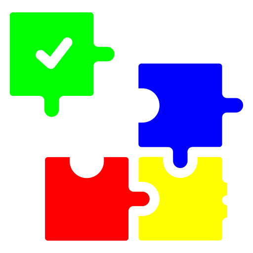
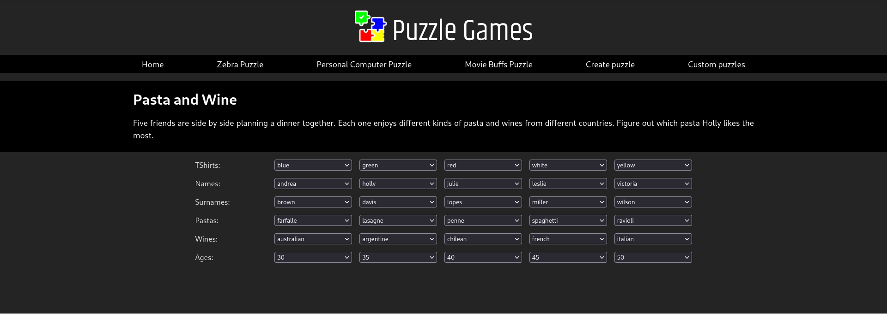
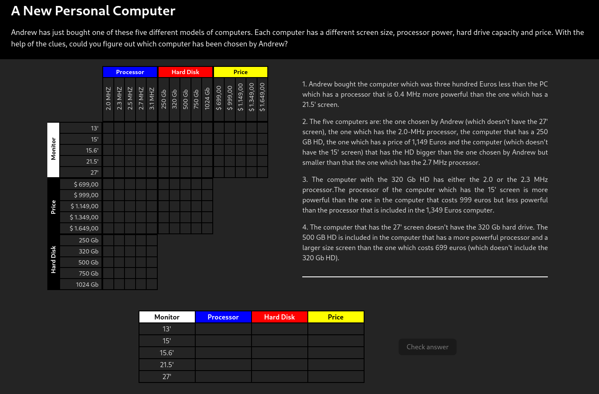
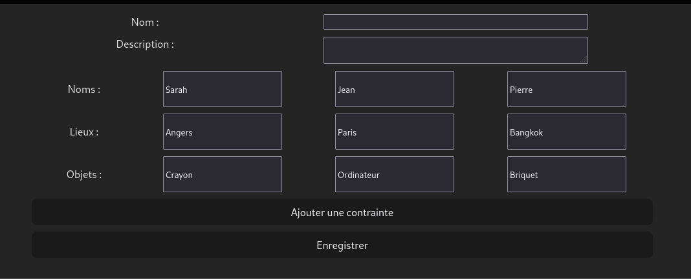
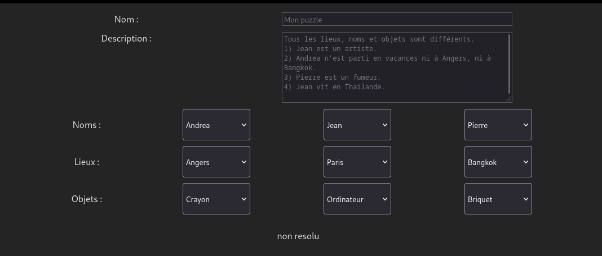

# Puzzle Customizer 



Projet réalisé par Romain Supiot, Chaïmaâ Touahmi, Julien Tartenson et Grégoire Bellon dans le cadre du cours d'optimisation combinatoire du M2 de l'Université d'Angers. 

Dans le cadre de ce projet, 3 puzzles ont été créés.




L'application propose aussi un éditeur permettant de créer ses propres puzzles.


Ces derniers sont stockés dans une base de données SQLite, et visualisables via une autre page.



## Setup
### Back
Notre version de minizinc est 2.8.3. Le projet n'a pas été testé avec une version antérieure

Le projet nécessite python (testé avec 3.11.7)

Pour installer les dépendances : 

```
pip install -r .flask/requirements.txt
```

Pour initialiser la db, se mettre dans le répertoire flask et taper la commande : 

```bash
flask --app app init-db
```

Pour le lancer : 

```bash
python ./run.py
```

### Front 
Le projet requiert node 20 ou supérieur.

Aller dans le répertoire du front (reactjs/app)

Installez les dépendances

```bash
npm install
```

Lancez le projet

```bash
npm run dev
```

## API :

Connecteurs logiques possibles : ```AND, OR, IMPLIES```

Comparateurs possibles : ```EQ, NEQ```

next est la suite de la comparaison, elle n'est pas requise.

La déclaration d'une contrainte est : 
```json
{
    "negative" : true,
    "atom" : { "comparator" : "EQ" , "operand" : "object1", "operand_type" : "OBJECT | NAME | PLACE" },
    "next" : {
        "connector" : "AND",
        "constraint" : {
            // récursivement... 
        }
    }
}
```

Exemple d'un problème pour custom puzzle : 

```
Tous les lieux, noms et objets sont différents.
1. Jean est un artiste.
2. Andrea n'est parti en vacances ni à Angers, ni à Bangkok.
3. Pierre est un fumeur.
4. Jean vit en Thailande.
```